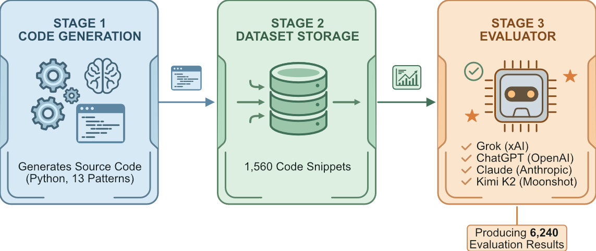
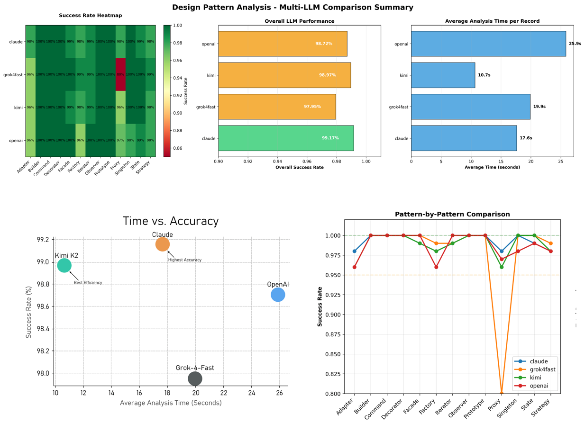

# Evaluating the Efficiency of Large Language Models in Design Pattern Recognition
Honours Research Project by Nikita Lanetsky, Edinburgh Napier University.

This project employs AI-driven static analysis to assess design pattern recognition, with a focus on the capabilities and efficiency of state-of-the-art Large Language Models (LLMs).

  

---
- [Introduction](#introduction)
  - [Abstract](#abstract)
  - [Research Objectives](#research-objectives)
- [Methodology/Research Setup](#methodologyresearch-setup)
  - [Design Patterns Under Investigation](#design-patterns-under-investigation)
  - [Chosen LLMs/Models](#chosen-llmsmodels)
- [Project Pillars](#project-pillars)
  - [Code Generation](#code-generation)
  - [Code Dataset](#code-dataset) 
  - [Design Pattern Recogniser](#design-pattern-recogniser)

## Introduction
### Abstract

This Honours project evaluates the proficiency and efficiency of contemporary Large Language Models (LLMs) in detecting implemented design patterns in source code. The study systematically benchmarks leading LLMs—Grok (xAI), GPT-series (OpenAI), Claude (Anthropic), and Kimi K2 (Moonshot)—using algorithmically generated code samples of varying complexity.

> [!NOTE]
> **Researcher Qualifications**: Anthropic Certified in Agentic AI & NVIDIA Certified in RAG Agents with LLMs.

### Research Objectives

**Primary Objectives**:
- Develop a code generation pipeline utilising multiple LLMs to produce design pattern implementations of varying complexity (E/M/H).
- Curate a large dataset of code snippets implementing 13 GoF design patterns, stratified by complexity levels.
- Analyse the dataset using LLMs to identify implemented design patterns.

**Secondary Objectives**:
- Analyse pattern recognition performance across varying code complexities.
- Assess the impact of single-prompt versus multi-layered workflows on identification accuracy.
- Establish standardised benchmarking methodologies for LLM-based code analysis.

**Additional Objectives**:
- Generate charts and graphs to visualise gathered data.
- Develop a Pattern Recommender module as proof-of-concept, demonstrating LLMs' potential to comprehend code semantics and refactor to best practices.

## Methodology/Research Setup

### Design Patterns Under Investigation

The study examines 13 GoF design patterns, categorised as follows:

| Category     | Patterns                          |
|--------------|-----------------------------------|
| **Creational** | Singleton, Factory, Builder, Prototype |
| **Structural** | Adapter, Decorator, Facade, Proxy |
| **Behavioural** | Observer, Strategy, Command, Iterator, State |

### Chosen LLMs/Models
The evaluation incorporates leading LLMs as of Q4 2025: Claude (Anthropic), Kimi K2 (Moonshot), GPT-series (OpenAI), and Grok (xAI).

## Project Pillars
The project comprises three interconnected pillars underpinning the evaluation of LLMs for design pattern recognition:

### Code Generation
Automated pipeline (CodeGenerator) for LLM-driven synthesis of Python code snippets implementing 13 GoF patterns at Easy (E), Medium (M), and Hard (H) difficulty levels. Includes LLM-based evaluation for pattern fidelity, syntax validity, and quality. See [Documentation/CodeGenerator.md](Documentation/CodeGenerator.md) for details.

### Code Dataset
Curated collection of validated snippets (CodeSnippets) stratified by pattern and complexity, forming the empirical foundation for recognition benchmarking.

### Design Pattern Recogniser
LLM-powered static analysis tool (PatternRecogniser) employing single-prompt or multi-layered workflows to detect patterns, generating reports, charts (PatternRecogniser/Charts/), and Excel outputs (PatternRecogniser/Reports/). Supports CLI usage for batch/custom analysis.

### Results

  

## Documentation

#### Manual Documentation
For detailed technical documentation on each module, see [Documentation/README.md](Documentation/README.md). This includes API references, CLI usage, and integration guides.

#### Generated Documentation
Code-level documentation is automatically generated from source and deployed on every commit via the project's CI/CD pipeline, ensuring it remains consistently up to date.  
The live generated documentation is available at: [Deployed Documentation](https://nikitaedin.github.io/AI-DesignPattern/).

## Disclaimer
Certain components of this repository were developed with the assistance of AI-generated code, limited strictly to the result analysis scripts (`f1_combined.py`, `chart_generator.py`, and `f1_score.py`). 
No AI-generated
code was used in the core project functionality.

All AI-generated contributions were thoroughly reviewed and refined to ensure accuracy and integrity of the results. For
transparency, each affected file is clearly marked at the top of the source code to indicate the use of AI assistance.